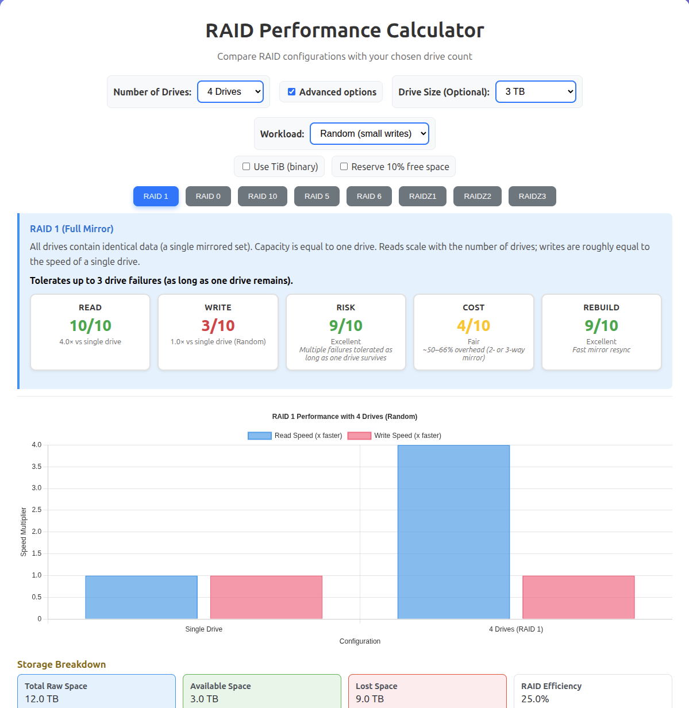

# RAID Performance Calculator

A simple and interactive tool to estimate RAID performance for various configurations.  
Try it live: [GitHub Pages Link](https://bradgarrison.github.io/raid-performance-calculator/)

---

## License & Usage
This project is licensed under the MIT License — feel free to use, share, and modify it as you please.  
A credit to the original author is appreciated but not required.  

**Author:** Brad Garrison  
📧 brad.garrison [at] jbtechconsulting [dot] com  
🔗 [GitHub Repository](https://github.com/bradgarrison/raid-performance-calculator)
